```{r include=FALSE}

hecbleu <- c("#002855")
fcols <- c(gris = "#888b8d",
           bleu = "#0072ce",
           aqua = "#00aec7",
           vert = "#26d07c",
           rouge = "#ff585d",
           rose = "#eb6fbd",
           jaune = "#f3d03e")
pcols <- c(gris = "#d9d9d6",
           bleu = "#92c1e9",
           agua = "#88dbdf",
           vert = "#8fe2b0",
           rouge = "#ffb1bb",
           rose = "#eab8e4",
           jaune = "#f2f0a1")
knitr::opts_chunk$set(fig.retina = 3, collapse = TRUE)
options(digits = 3, width = 75)
```

## Scientific problem

In Montréal, *Société des transports de Montréal* (STM) reports an average of 1,000 service interruptions per year lasting more than 5 minutes.

- Common causes of disruptions include equipment failures, passenger incidents,
track obstructions, and operational issues.
- The concept of travel time is linked with the waiting time of the passengers.
- Accurate travel time prediction becomes particularly critical during the recovery
phase following a disruption.

## Disruption

- Disruptions occur unpredictably.
- Even after a disruption is officially resolved, service recovery may take a
substantial amount of time.
- We aim to predict waiting times during the recovery phase, along with suitable **uncertainty quantification**.


## Layman summary of motivation

The metro service is resuming following an incident.

```{r}
#| fig-align: 'center'
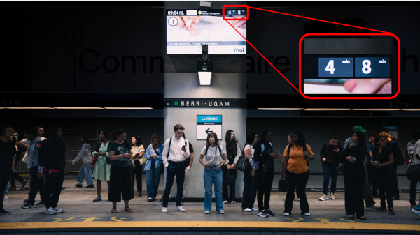
```

How much longer until the next train arrives?


## Features of the problem

There are relatively few studies on urban metro networks compared to intercity railway systems.

Some (unique) characteristics of the Montréal metro:

::: {style="font-size: 0.9em;"}

- The metro system is a closed-loop in each direction (no overtaking).
- No information about passenger flow in real-time.
- Absence of schedule (only average frequency). 
- Operational procedures for incidents depending on the time of the day, their duration and underlying cause.

::: 

## Video of incident {background-video="figures/video.mp4"}

## Operational protocols


- Trains can be required to stop immediately at the nearest station.
- Trains can be permitted to continue their journey for several stations before being forced to stop.
- Post-disruption, trains are unevenly spaced, leading to train bunching.
- This leads to passenger accumulation and increased waiting times.


## Data source 1 - track occupancy data {.smaller}

- Montréal metro uses a fixed block (sensor) signaling system. 
- Rail tracks (platforms and tunnels) are divided into blocks of variable length.
- Sensors record occupation and release of a block.

```{r}
#| out-width: "100%"
#| fig-align: "center"
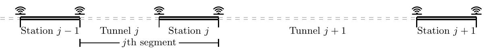
```

- The track occupancy data include timestamps (entry/exit), block and train identifiers.
- These are used to reconstruct train journeys (including location and relative distance of all trains).

## Data source 2 - disruption logs

A dataset of all the reported incidents. 

STM records location, duration and beginning end of incidents, but

- not all events are reported,
- there are some inaccuracies (resolution times, locations): we fix these using timestamps of track occupancy data.


## Metro and incidents


:::: {.columns}

::: {.column width="65%"}

```{r}
#| out-width: "120%"
#| fig-align: "center"
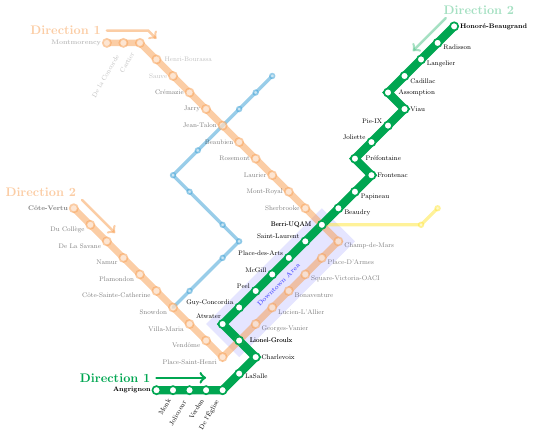
```

:::

::: {.column width="35%"}

Data are from 2018.

::: {style="font-size: 0.8em;"}
On the Green line:

- around 225 disruptions in each direction,
- lasting on average 11 minutes, 
- affecting on average 7.5 trains.

:::

:::
::::


## Notation

We model the travel time $Y_{i,j,k}(t)$ of train $i$ from origin station $j$ to destination station $k$ at time $t.$

```{r}
#| out-width: "100%"
#| fig-align: "center"
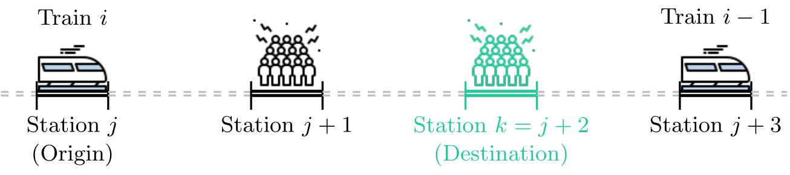
```

## Decomposition of travel time


$$\underset{\text{time}}{Y_{i,j,k}(t)} = \underset{\text{delay}}{D_{i,j}} + \underset{\text{journey}}{J_{i,j,k}(t)} + \underset{\vphantom{t}\text{error}}{e_{i,j,k}}.$$

```{r}
#| out-width: "100%"
#| fig-align: "center"
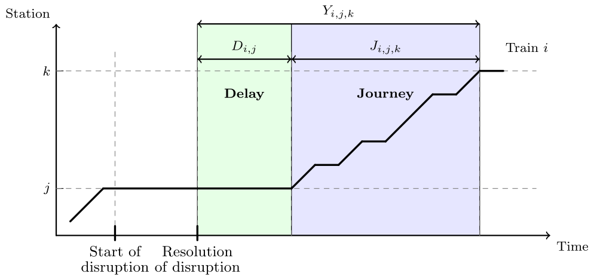
```


## Delay modelling

::: {style="font-size: 0.75em;"}
We suppose that train operations are influenced by the presence of other trains
ahead of them in the direction of travel,


\begin{equation}
    D_{i, j} = \sum_{l = 1}^{D_{\max}} \gamma_{l, j} z_{i, j, l}. \label{eq:delay}
\end{equation}

Effects $\gamma_{l,j}$ depend on distance ahead (up to $D_{\max}=5$ stations) and station.


:::

```{r}
#| out-width: "80%"
#| fig-align: "center"
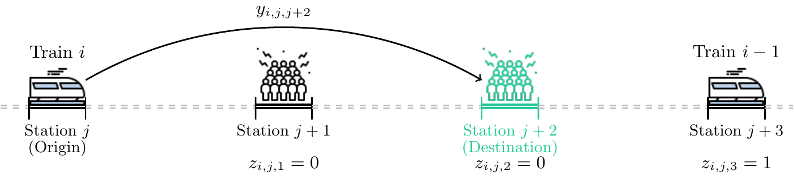
```
::: {style="font-size: 0.75em;"}
$z_{i,j,l}$: is there is another train $l$ stations
ahead when train $i$ was at station $j$.
:::


## Journey modelling

**Journey** $J_{i,j,k}(t):$ total time a train spends traversing both platforms and tunnel segments when traveling from origin $j$ to destination $k$ at time $t.$

Decomposed as the sum of 

- **dwell times**: the time a train remains stationary at intermediate stations $j+1, \ldots, k-1,$
- **running times**: times required to travel between stations (through tunnels).

## Dwell times and running times at Guy-Concordia

```{r}
#| out-width: "70%"
#| fig-align: "center"
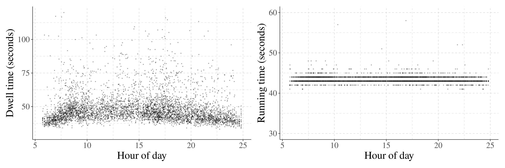
```

::: {style="font-size: 0.7em;"}

Running times exhibit relatively low variability because train speeds are tightly regulated by operational constraints. 

:::

## Headways and travel times

```{r}
#| out-width: "100%"
#| fig-align: "center"
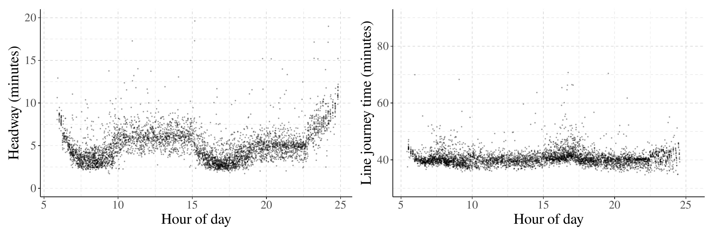
```

::: {style="font-size: 0.8em;"}
Both travel time and headway (temporal gap between two consecutive trains) vary significantly according to the time of the day.

:::

The larger the headway between trains, the more passengers accumulate on the platforms at intermediate stations, leading to increased dwell times.

## Journey process

We estimate median headway $\widetilde{h}_{s}(t)$ at station $s$ and time $t$  using a moving-window (since passenger flow varies over time of the day).

\begin{align*}
    J_{i, j, k}(t) = t_0 + \underset{\text{median travel time}}{\widetilde{Y}_{j, k}(t)} + \sum_{s = j + 1}^{k - 1} \theta_s \underset{\substack{\text{difference to}\\\text{median headway}}}{[h_{i, s} - \widetilde{h}_{s}(t)]}.
\end{align*}


For every additional minute of prolonged headway at an intermediary station $s$, the journey process increases by $\theta_s.$


## Variance specification


:::: {.columns}

::: {.column width="50%"}

```{r}
#| out-width: "80%"
#| fig-align: "center"
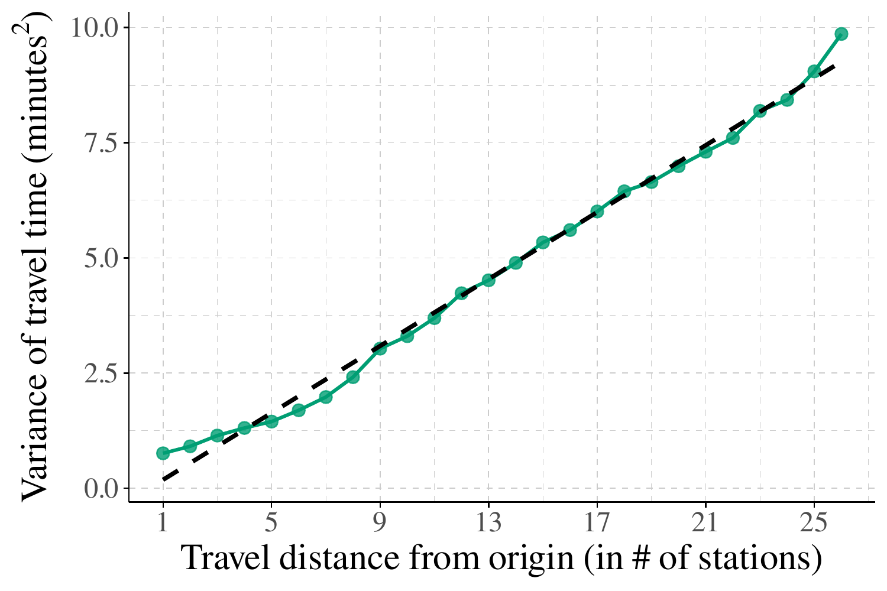
```

:::


::: {.column width="50%"}

Travel times consist of the sum of running times (mostly identical) and dwell times.

It seems reasonable to hypothesize that the variance increases linearly with the traveled distance, with $\sigma^2= \omega_0 + \omega_1 (k-j).$
:::

::::


## Autocorrelation structure


:::: {.columns}

::: {.column width="50%"}

```{r}
#| out-width: "100%"
#| fig-align: "center"
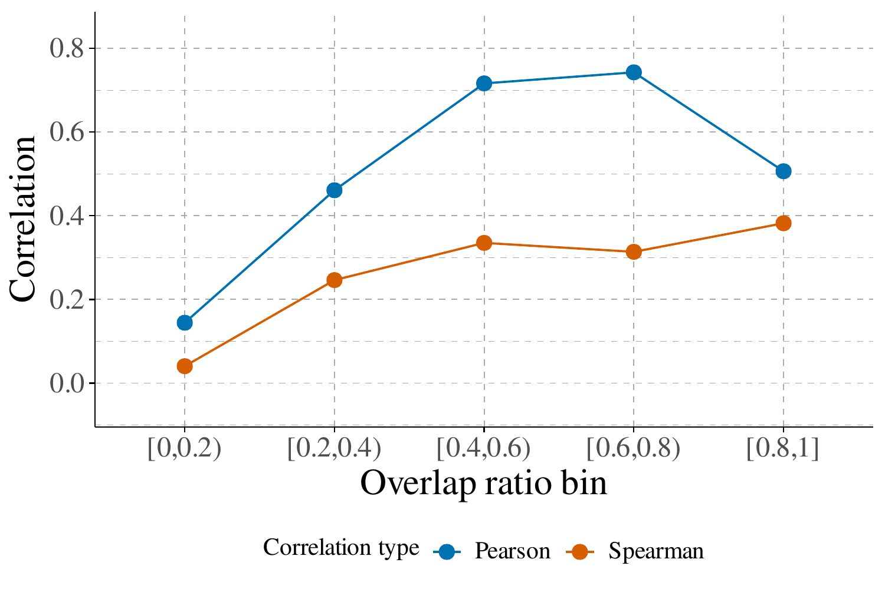
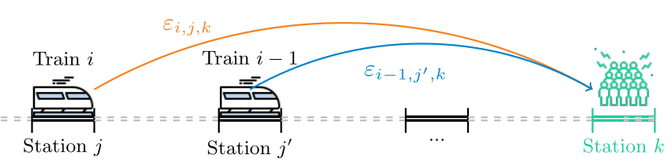
```
:::

::: {.column width="50%"}

::: {style="font-size: 0.7em;"}
To account for the dependence between consecutive trains, we use a moving average (MA) that depend on the overlap in journey during post-disruption $$\Delta_i = (k-j)/(k-j') \in [0,1),$$ between trains $i$ and $i-1$ for stations $j < j' < k.$

The error term is written as $$e_{i,j,k} = \rho_i\varepsilon_{i-1, j',k} + \varepsilon_{i, j,k}$$ with an exponential-type decay,
\begin{align*}
\rho_i &= \rho \left\{1 - \exp\!\left(-\lambda\Delta_i\right)\right\}.
\end{align*}
:::

:::

::::


## Prediction

The model including delay, journey and error is
\begin{align*}
\underbrace{Y_{i, j, k}(t)}_{\text{travel time}} &=  \underbrace{D_{i,j}}_{\text{delay}} + \underbrace{J_{i, j, k}(t)}_{\text{journey}} + \underbrace{\rho_i\varepsilon_{i-1, j', k} + \varepsilon_{i, j, k}}_{\text{error}}.
\end{align*}

The unconditional **predictive distribution** is obtained by integrating out the latent innovation of the preceding train:
\begin{align*}
p(y_{i,j,k})
= \int p\!\left(y_{i, j, k} \mid \varepsilon_{i-1, j', k} \right) 
p\!\left(\varepsilon_{i-1, j', k}\right) \, \mathrm{d}\varepsilon_{i-1, j', k},
\end{align*}
which does not admit a closed-form expression. 


## Error distribution

We consider three location-scale distributions for random errors $\varepsilon_{i,j,k}.$

- normal,
- a skew-normal with skewness $\alpha,$
- a skew-$t$ with skewness $\alpha$ and degrees of freedom $\nu.$

Both skewed distributions have a mean and variance that are a function of the skewness $\alpha$ (and the degrees of freedom $\nu$ for the skew-$t$).


## Distributional assumption 


::: {style="font-size: 0.7em;"}
There are several outliers and skewed residuals due to 
asymmetry: trains can run late, but not really cut on journey times.

:::

```{r}
#| out-width: "80%"
#| fig-align: "center"
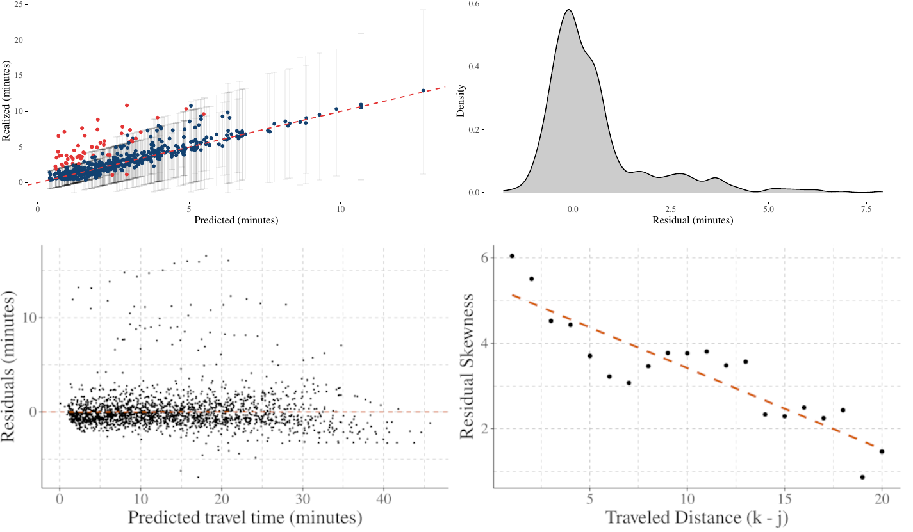
```

::: {style="font-size: 0.7em;"}
We specify the skewness as a linear function $\alpha=\alpha_0 + (k-j)\alpha_1.$
:::

## Model estimation and prediction

We work in the Bayesian framework and assign weak (e.g., truncated priors to have decreasing variance and skewness) or vague priors.

We generate posterior draws from the hierarchical model using Hamiltonian Monte Carlo (through **Stan**).

Posterior predictive inference is carried out via simulation by jointly sampling the model parameters and latent errors.

We split the 21K time stamps by disruption into 90% training and 10% hold-out.

## Posterior of delay

```{r}
#| out-width: "100%"
#| fig-align: "center"
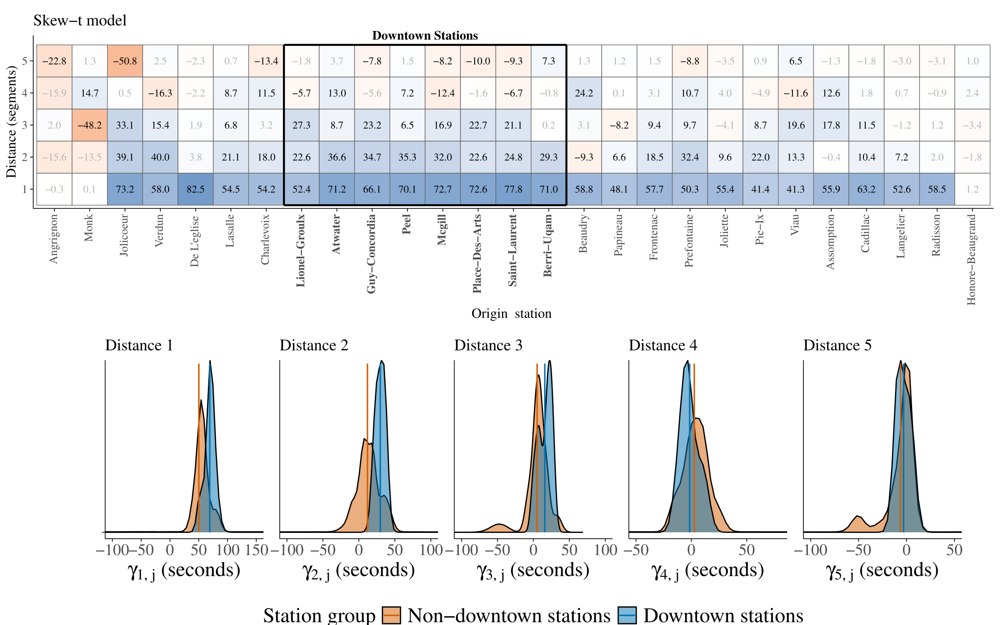
```

## Posterior of parameters


```{r}
#| out-width: '80%'
#| fig-align: "center"
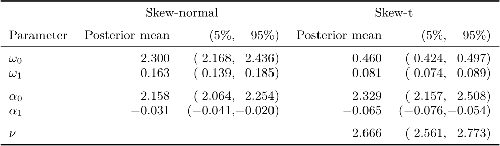
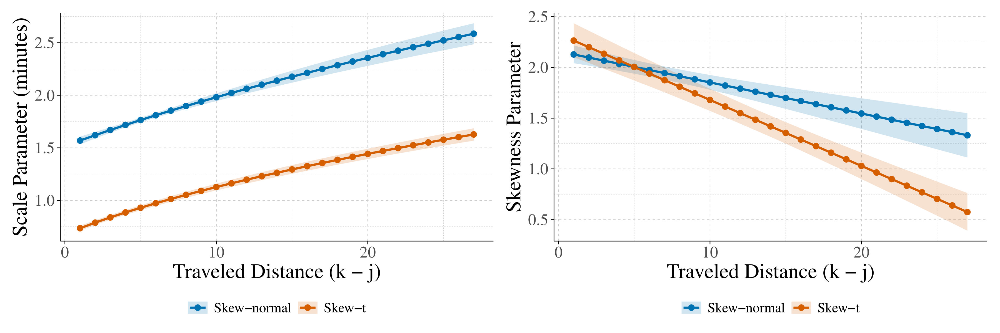
```

::: {style="font-size: 0.7em;"}

Skewness, scale and degree of freedom parameters.

:::

## Goodness-of-fit

```{r}
#| out-width: "80%"
#| fig-align: "center"
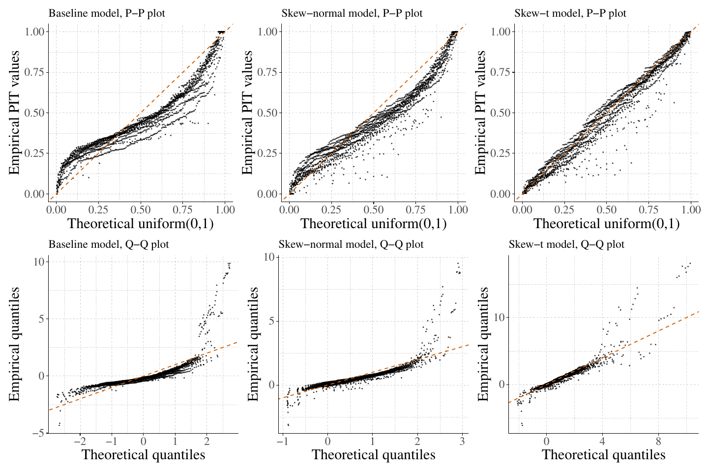
```


## Performance metrics

```{r}
#| out-width: "80%"
#| fig-align: "center"
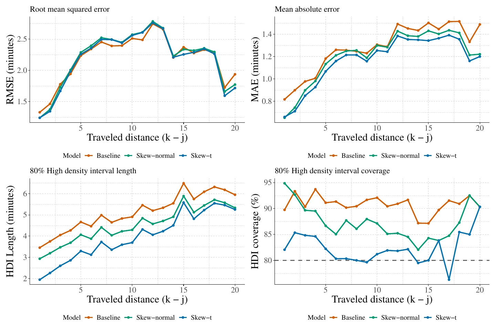
```

The skewed-$t$ model has better coverage and also lower CRPS values.

## Summary


::: {style="font-size: 0.8em;"}

- We examined the problem of predicting post-disruption travel times in an urban metro system.
- We proposed a Bayesian hierarchical model that explicitly accounts for train
interactions, headway imbalance due to disruption, and non-Gaussian features in
travel time distributions.
- The results provide evidence of meaningful error dependence between consecutive
trains.
- Possible extensions include online forecasting setting, in which predictions are
continuously updated as new real-time operational information becomes available.

:::

## The end


Thank you for your attention. Questions?


:::: {.columns}

::: {.column width="50%"}

Financial support:

```{r}
#| out-width: "70%"
#| fig-align: "center"

```

:::


::: {.column width="50%"}


Preprint: [`arXiv:2602.19952`](https://arxiv.org/abs/2602.19952)

```{r}
#| out-width: "60%"
#| fig-align: "center"

```

:::

::::
